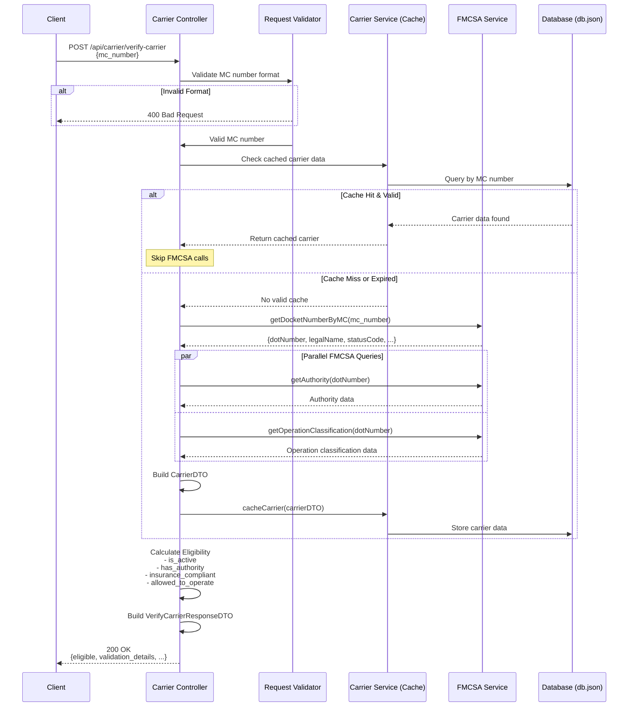
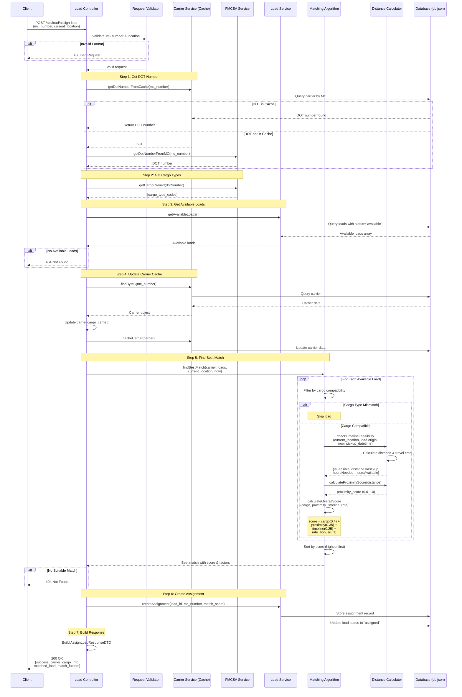

# API Reference

This document provides detailed API specifications for the Inbound Carrier Sales Automation system, including request/response contracts and data flow diagrams.

---

## Table of Contents
- [1. Verify Carrier Endpoint](#1-verify-carrier-endpoint)
- [2. Assign Load Endpoint](#2-assign-load-endpoint)

---

## 1. Verify Carrier Endpoint

### Overview
Verifies a carrier's eligibility to receive load assignments by validating their credentials and compliance status with FMCSA (Federal Motor Carrier Safety Administration).

### Endpoint Details
- **URL**: `/api/carrier/verify-carrier`
- **Method**: `POST`
- **Content-Type**: `application/json`

---

### Request Contract

#### Request Body
```json
{
  "mc_number": "string"
}
```

#### Request Parameters

| Field | Type | Required | Description | Validation |
|-------|------|----------|-------------|------------|
| `mc_number` | string | Yes | Motor Carrier number to verify | Must be valid MC number format (e.g., "MC-123456" or "123456") |

#### Example Request
```json
{
  "mc_number": "1234567"
}
```

---

### Response Contract

#### Success Response (200 OK)
```json
{
  "eligible": boolean,
  "mc_number": "string",
  "dot_number": "string",
  "legal_name": "string",
  "validation_details": {
    "is_active": boolean,
    "has_authority": boolean,
    "insurance_compliant": boolean,
    "allowed_to_operate": boolean
  }
}
```

#### Response Fields

| Field | Type | Description |
|-------|------|-------------|
| `eligible` | boolean | Overall eligibility status (true if carrier passes all checks) |
| `mc_number` | string | Normalized MC number |
| `dot_number` | string | DOT number retrieved from FMCSA |
| `legal_name` | string | Legal business name of the carrier |
| `validation_details` | object | Breakdown of eligibility checks |
| `validation_details.is_active` | boolean | Carrier status is "A" (Active) |
| `validation_details.has_authority` | boolean | Has active common or contract authority |
| `validation_details.insurance_compliant` | boolean | BIPD insurance on file meets requirements |
| `validation_details.allowed_to_operate` | boolean | Carrier is allowed to operate per FMCSA |

#### Eligibility Criteria
A carrier is considered `eligible: true` when ALL of the following are met:
- Status is Active (`is_active: true`)
- Allowed to operate (`allowed_to_operate: true`)
- Has active authority (`has_authority: true`)
- Insurance compliant (`insurance_compliant: true`)

#### Example Success Response
```json
{
  "eligible": true,
  "mc_number": "1234567",
  "dot_number": "987654",
  "legal_name": "ABC Trucking LLC",
  "validation_details": {
    "is_active": true,
    "has_authority": true,
    "insurance_compliant": true,
    "allowed_to_operate": true
  }
}
```

#### Error Response (400 Bad Request)
```json
{
  "error": "Invalid MC number format"
}
```

#### Error Response (404 Not Found)
```json
{
  "error": "Carrier not found in FMCSA database"
}
```

---

### Data Flow Diagram



---

### Data Flow Description

1. **Request Validation**: MC number format is validated using middleware
2. **Cache Check**: System checks if carrier data exists in cache and is still valid (not expired)
3. **FMCSA Data Fetch** (if cache miss):
   - Query docket number endpoint to get DOT number and basic info
   - Query authority and operation classification endpoints in parallel
   - Build complete carrier profile
4. **Caching**: Store carrier data with timestamp for future requests
5. **Eligibility Calculation**: Evaluate carrier against four criteria
6. **Response**: Return eligibility status with detailed validation breakdown

**Cache Strategy**: Reduces FMCSA API calls by storing carrier data locally with timestamps. Subsequent requests use cached data if still valid.

---

## 2. Assign Load Endpoint

### Overview
Finds and assigns the best matching freight load for a carrier based on their cargo capabilities, current location, and availability. Uses a sophisticated matching algorithm that considers cargo type compatibility, location proximity, and timeline feasibility.

### Endpoint Details
- **URL**: `/api/load/assign-load`
- **Method**: `POST`
- **Content-Type**: `application/json`

---

### Request Contract

#### Request Body
```json
{
  "mc_number": "string",
  "current_location": "string"
}
```

#### Request Parameters

| Field | Type | Required | Description | Validation |
|-------|------|----------|-------------|------------|
| `mc_number` | string | Yes | Motor Carrier number | Must be valid MC number format |
| `current_location` | string | Yes | Carrier's current location | Must be in format "City, State" (e.g., "Dallas, TX") |

#### Example Request
```json
{
  "mc_number": "1234567",
  "current_location": "Dallas, TX"
}
```

---

### Response Contract

#### Success Response (200 OK)
```json
{
  "success": boolean,
  "carrier_cargo_info": {
    "mc_number": "string",
    "dot_number": "string",
    "cargo_types": [number]
  },
  "matched_load": {
    "load_id": number,
    "origin": "string",
    "destination": "string",
    "pickup_datetime": "ISO 8601 date string",
    "delivery_datetime": "ISO 8601 date string",
    "equipment_type": "string",
    "loadboard_rate": number,
    "notes": "string",
    "weight": number,
    "commodity_type": number,
    "num_pieces": number,
    "miles": number,
    "dimensions": "string",
    "match_score": number
  },
  "match_factors": {
    "cargo_match": boolean,
    "location_proximity": number,
    "timeline_feasible": boolean,
    "distance_to_pickup_miles": number,
    "estimated_travel_hours": number,
    "hours_available": number,
    "buffer_hours": number
  }
}
```

#### Response Fields

| Field | Type | Description |
|-------|------|-------------|
| `success` | boolean | Operation success indicator |
| `carrier_cargo_info` | object | Carrier's cargo hauling capabilities |
| `carrier_cargo_info.mc_number` | string | Normalized MC number |
| `carrier_cargo_info.dot_number` | string | DOT number |
| `carrier_cargo_info.cargo_types` | number[] | Array of cargo type codes the carrier can haul (1-30) |
| `matched_load` | object | Best matching load with all details |
| `matched_load.load_id` | number | Unique load identifier |
| `matched_load.origin` | string | Pickup location (City, State) |
| `matched_load.destination` | string | Delivery location (City, State) |
| `matched_load.pickup_datetime` | string | Pickup date/time (ISO 8601) |
| `matched_load.delivery_datetime` | string | Delivery date/time (ISO 8601) |
| `matched_load.equipment_type` | string | Required equipment (e.g., "Dry Van", "Flatbed") |
| `matched_load.loadboard_rate` | number | Payment rate in dollars |
| `matched_load.weight` | number | Load weight in pounds |
| `matched_load.commodity_type` | number | Cargo type code (1-30) |
| `matched_load.miles` | number | Total route distance |
| `matched_load.match_score` | number | Overall match quality (0.0 - 1.0) |
| `match_factors` | object | Detailed breakdown of match scoring |
| `match_factors.cargo_match` | boolean | Carrier can haul this cargo type |
| `match_factors.location_proximity` | number | Proximity score (0.0 - 1.0, higher is closer) |
| `match_factors.timeline_feasible` | boolean | Carrier can reach pickup in time |
| `match_factors.distance_to_pickup_miles` | number | Distance from current location to pickup |
| `match_factors.estimated_travel_hours` | number | Hours needed to reach pickup |
| `match_factors.hours_available` | number | Hours available before pickup |
| `match_factors.buffer_hours` | number | Time buffer (hours_available - estimated_travel_hours) |

#### Match Score Calculation

The `match_score` (0.0 - 1.0) is calculated using weighted factors:

```
match_score = (cargo_match × 0.40) + 
              (location_proximity × 0.35) + 
              (timeline_feasible × 0.25) + 
              rate_bonus (max 0.10)
```

**Weights:**
- **Cargo Compatibility**: 40% (mandatory requirement)
- **Location Proximity**: 35% (closer is better)
- **Timeline Feasibility**: 25% (can reach pickup in time)
- **Rate Bonus**: Up to 10% (higher paying loads get small boost)

#### Example Success Response
```json
{
  "success": true,
  "carrier_cargo_info": {
    "mc_number": "1234567",
    "dot_number": "987654",
    "cargo_types": [1, 3, 15]
  },
  "matched_load": {
    "load_id": 42,
    "origin": "Houston, TX",
    "destination": "Atlanta, GA",
    "pickup_datetime": "2025-10-25T08:00:00.000Z",
    "delivery_datetime": "2025-10-26T18:00:00.000Z",
    "equipment_type": "Dry Van",
    "loadboard_rate": 2850.00,
    "notes": "Expedited delivery required",
    "weight": 35000,
    "commodity_type": 1,
    "num_pieces": 24,
    "miles": 789,
    "dimensions": "48x40x72",
    "match_score": 0.87
  },
  "match_factors": {
    "cargo_match": true,
    "location_proximity": 0.92,
    "timeline_feasible": true,
    "distance_to_pickup_miles": 45.3,
    "estimated_travel_hours": 0.75,
    "hours_available": 62.5,
    "buffer_hours": 61.75
  }
}
```

#### Error Response (404 Not Found)
```json
{
  "error": "No available loads found"
}
```

```json
{
  "error": "No suitable loads found for this carrier"
}
```

#### Error Response (400 Bad Request)
```json
{
  "error": "Invalid location format (expected: \"City, State\")"
}
```

---

### Data Flow Diagram



---

### Data Flow Description

1. **Request Validation**: Validates MC number format and location format ("City, State")

2. **DOT Number Resolution**: 
   - Check cache for DOT number
   - If not cached, query FMCSA docket number endpoint
   - Cache result for future requests

3. **Cargo Capabilities Fetch**: 
   - Query FMCSA cargo-carried endpoint with DOT number
   - Returns array of cargo type codes (1-30) the carrier is authorized to haul
   - Update carrier cache with cargo data

4. **Load Retrieval**: 
   - Fetch all loads with status "available" from database
   - Return empty if no loads available

5. **Matching Algorithm** (core logic):
   
   **a. Cargo Filtering** (mandatory):
   - Filter loads to only those with commodity types the carrier can haul
   - Uses direct cargo type code matching
   
   **b. For Each Compatible Load**:
   - Calculate distance from current location to pickup location
   - Estimate travel time needed to reach pickup
   - Check if carrier can reach pickup before pickup_datetime
   - Calculate proximity score (closer = higher score)
   
   **c. Score Calculation**:
   ```
   match_score = (cargo_match × 0.40) +           # Binary: pass/fail
                 (location_proximity × 0.35) +     # 0.0-1.0 based on distance
                 (timeline_feasible × 0.25) +      # Binary: can reach in time
                 min(rate/10000, 0.10)             # Bonus for higher rates
   ```
   
   **d. Sort & Select**:
   - Sort all compatible loads by match_score (descending)
   - Return highest scoring load

6. **Assignment Creation**:
   - Store assignment record linking load to carrier
   - Update load status from "available" to "assigned"
   - Record match score for analytics

7. **Response Building**:
   - Return carrier cargo info
   - Return matched load with match_score
   - Return detailed match_factors for transparency

---

### Matching Algorithm Details

#### Cargo Type Compatibility
The system uses FMCSA's 30 standardized cargo type codes:
- **Code 1**: General Freight
- **Code 3**: Metal: sheets, coils, rolls
- **Code 15**: Machinery, Large Objects
- *(see `/src/constants/cargoTypes.ts` for full list)*

A carrier can only be matched with loads whose `commodity_type` is in the carrier's `cargo_types` array.

#### Proximity Score Formula
```javascript
proximityScore = Math.max(0, 1 - (distance / 500))
```
- Distance < 50 miles: score ≈ 0.9 - 1.0
- Distance 100-200 miles: score ≈ 0.6 - 0.8
- Distance > 500 miles: score = 0.0

#### Timeline Feasibility
```javascript
hoursAvailable = (pickup_datetime - now) in hours
hoursNeeded = distance / assumed_average_speed
timeline_feasible = hoursAvailable >= hoursNeeded
buffer_hours = hoursAvailable - hoursNeeded
```

---

### Important Notes

#### Equipment Type Consideration
**Note**: Equipment type is NOT used in matching because FMCSA API does not provide carrier equipment data. Matching is based on:
- Cargo type compatibility (from FMCSA cargo-carried endpoint)
- Location proximity (calculated using real distances)
- Timeline feasibility (considers travel time)
- Rate optimization (small bonus for higher rates)

#### Carrier Availability
The system assumes the carrier is available immediately (current date/time). To support future scheduling, the client would need to pass an `available_datetime` parameter (currently not implemented).

## Cargo Type Reference

The system uses standardized cargo type codes. Found on Motor Carrier Report Application file https://wsp.wa.gov/wp-content/uploads/2017/11/390_form1-1.pdf 

| Code | Description |
|------|-------------|
| 1 | General Freight |
| 2 | Household Goods |
| 3 | Metal: sheets, coils, rolls |
| 5 | Motor Vehicles |
| 7 | Drive/Tow away |
| 10 | Logs, Poles, Beams, Lumber |
| 13 | Building Materials |
| 15 | Machinery, Large Objects |
| 18 | Fresh Produce |
| 19 | Liquids/Gases |
| 20 | Intermodal Containers |
| 21 | Passengers |
| 22 | Oil Field Equipment |
| 23 | Livestock |
| 24 | Grain, Feed, Hay |
| 25 | Coal/Coke |
| 26 | Meat |
| 27 | Garbage/Refuse |
| 28 | US Mail |
| 29 | Chemicals |
| 30 | Commodities Dry Bulk |

For the complete list, see `/src/constants/cargoTypes.ts`.

---

## Rate Limiting & Caching

### Carrier Data Caching
- Carrier data fetched from FMCSA is cached locally in `db.json`
- Cache includes timestamp for expiration checking
- Reduces FMCSA API calls and improves response times
- Recommended cache TTL: 24-48 hours

### FMCSA API Considerations
- FMCSA API responses can be slow (1-3 seconds per endpoint)
- System makes parallel requests where possible (authority + operation classification)
- Consider implementing retry logic for production use

---

## Examples

### Complete Flow Example: Verify then Assign

#### Step 1: Verify Carrier
```bash
POST /api/carrier/verify-carrier
Content-Type: application/json

{
  "mc_number": "MC-1234567"
}
```

**Response:**
```json
{
  "eligible": true,
  "mc_number": "1234567",
  "dot_number": "987654",
  "legal_name": "ABC Trucking LLC",
  "validation_details": {
    "is_active": true,
    "has_authority": true,
    "insurance_compliant": true,
    "allowed_to_operate": true
  }
}
```

#### Step 2: Assign Load
```bash
POST /api/load/assign-load
Content-Type: application/json

{
  "mc_number": "MC-1234567",
  "current_location": "Dallas, TX"
}
```

**Response:**
```json
{
  "success": true,
  "carrier_cargo_info": {
    "mc_number": "1234567",
    "dot_number": "987654",
    "cargo_types": [1, 3, 15]
  },
  "matched_load": {
    "load_id": 42,
    "origin": "Houston, TX",
    "destination": "Atlanta, GA",
    "pickup_datetime": "2025-10-25T08:00:00.000Z",
    "delivery_datetime": "2025-10-26T18:00:00.000Z",
    "equipment_type": "Dry Van",
    "loadboard_rate": 2850.00,
    "notes": "Expedited delivery required",
    "weight": 35000,
    "commodity_type": 1,
    "num_pieces": 24,
    "miles": 789,
    "dimensions": "48x40x72",
    "match_score": 0.87
  },
  "match_factors": {
    "cargo_match": true,
    "location_proximity": 0.92,
    "timeline_feasible": true,
    "distance_to_pickup_miles": 45.3,
    "estimated_travel_hours": 0.75,
    "hours_available": 62.5,
    "buffer_hours": 61.75
  }
}
```

---

## Error Handling

All endpoints return consistent error responses:

```json
{
  "error": "Error message describing what went wrong"
}
```

Common error scenarios:
- Invalid MC number format → 400 Bad Request
- Invalid location format → 400 Bad Request
- Carrier not found in FMCSA → 404 Not Found
- No available loads → 404 Not Found
- No suitable matches → 404 Not Found
- FMCSA API timeout → 500 Internal Server Error

---

## Testing

### Using cURL

**Verify Carrier:**
```bash
curl -X POST http://localhost:3000/api/carrier/verify-carrier \
  -H "Content-Type: application/json" \
  -d '{"mc_number": "MC-1234567"}'
```

**Assign Load:**
```bash
curl -X POST http://localhost:3000/api/load/assign-load \
  -H "Content-Type: application/json" \
  -d '{"mc_number": "MC-1234567", "current_location": "Dallas, TX"}'
```

### Using Postman or Insomnia

Import the example payloads from `/example_payloads/` directory for testing with mock FMCSA responses.

---

## Additional Resources

- **Main Documentation**: `/README.md`
- **Deployment Guide**: `/DEPLOYMENT.md`
- **Mock Data README**: `/data/MOCK_DATA_README.md`
- **Example FMCSA Payloads**: `/example_payloads/`

---

